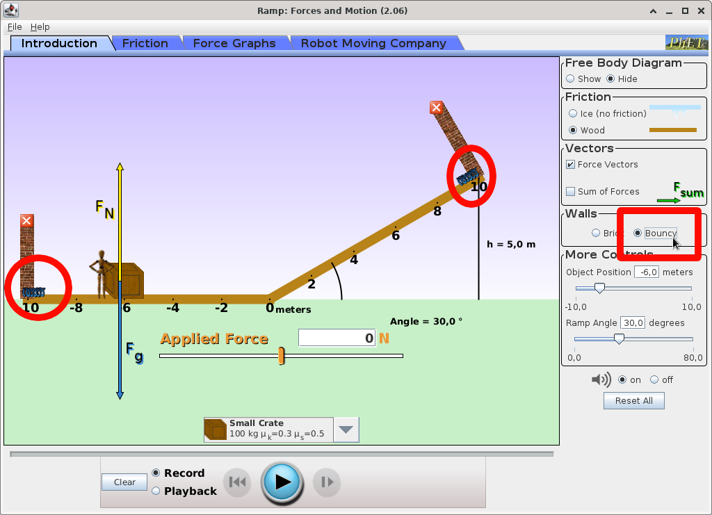
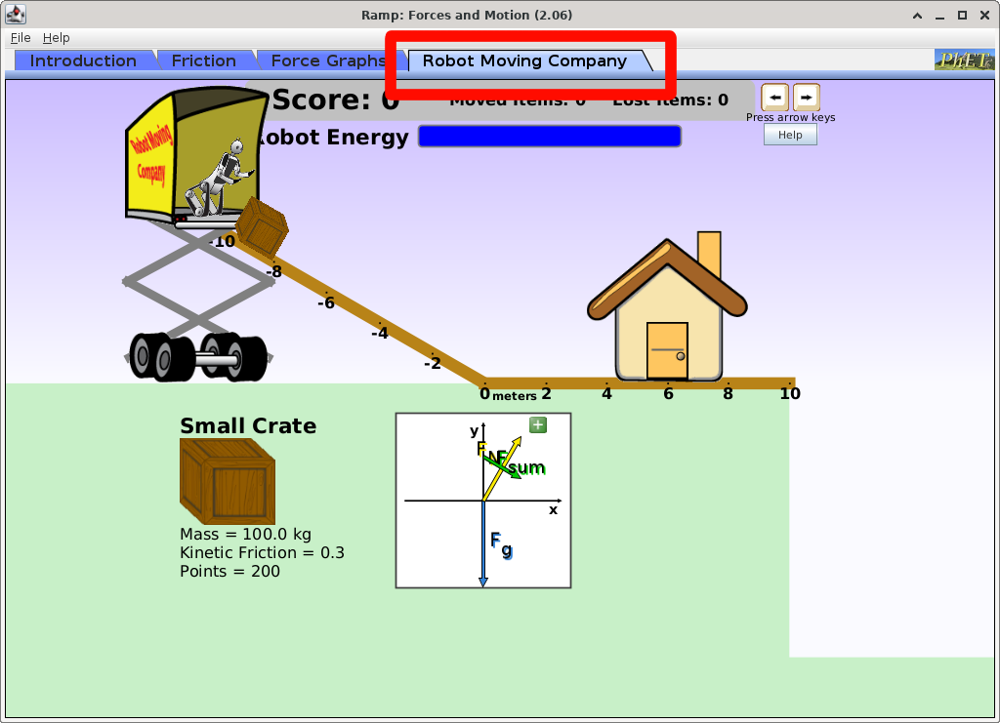
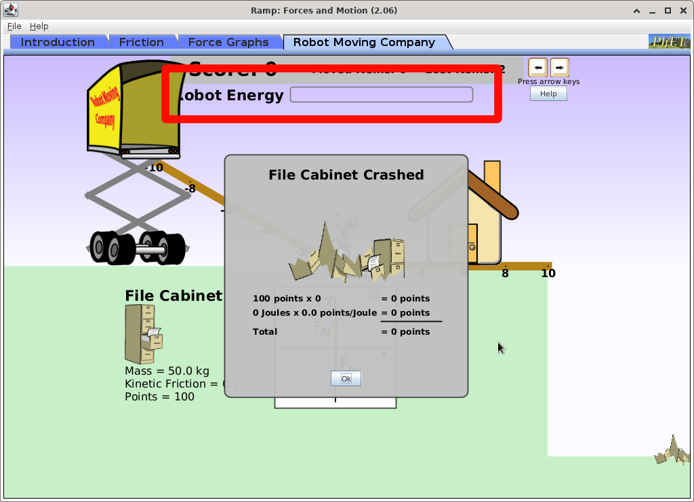

# EduApps-Linux

Aluna: Paula Caires Silva

Professor: Tersio Guilherme de Souza Cruz

FÍSICA GERAL 1 

Bem-vindos ao tutorial EduApps-Linux. Aqui, você encontrará tutoriais de aplicativos Linux voltados para o ensino da física. 
Os principais critérios para a escolha dos aplicativos são:
- Eles estão disponíveis para serem instalados em distribuições Linux, especialmente aqueles baseados no Debian.
- Uma vez instalados, os aplicativos não precisam usar a rede de Internet local.

> [!IMPORTANT] 
> Os aplicativos podem ser instalados no site do [PhET](https://phet.colorado.edu/). Para acessá-los, basta usar o comando `java -jar nome_app.jar`

# Tutoriais

1. [Ramp: Forces and Motion](#ramp-forces-and-motion)

## Ramp: Forces and Motion

O [Ramp: Forces and Motion](https://phet.colorado.edu/en/simulations/ramp-forces-and-motion) é um aplicativo de simulações de física mecânica em um plano inclinado.
Nesse programa, o aluno aprenderá como a força externa aplicada sobre um objeto pode mudar o movimento dele, utilizando os vetores, diagramas e também gráficos.

A primeira visão do aplicativo ao ser aberto é essa:

É possível ver um boneco e um bloco dispostos em repouso em uma reta. À frente deles, há um plano inclinado cujo ângulo pode ser alterado arrastando o plano inclinado ou alterando o valor no menu disposto à direita.
No inferior central da tela, é possível mudar o objeto o qual o boneco vai aplicar à força, cada um com sua massa diferente.

No campo destacado em vermelho, é possível escrever manualmente a força que você deseja aplicar no bloco.

Aplicando a força, o bloco irá se movimentar.

Também tem como usar o cursor e arrastar o vetor de tal forma a interagir com o bloco!

Você pode colocar molas nas extremidades da pista, conforme ilustrado abaixo.

Para simular uma situação ideal sem atrito, selecione a pista de gelo.

Além disso, para te ajudar nos exercícios, abra o diagrama do corpo.

> [!TIP]
> **✍️ Exercício para praticar!** | Selecione o objeto "_Mystery Object_" e o ambiente de pista de gelo, sem molas. Calcule a massa desse bloco misterioso.

Na parte superior do aplicativo, existem outras simulações. Na parte "_Force Graphs_", em que é possível fazer as mesmas simulações da primeira parte do programa, mas com a visualização da força que está sendo aplicada no objeto.

Também é possível testar a fricção e alterar a gravidade em "_Friction_".

> [!TIP]
> **✍️ Exercício para praticar!** | Como o objeto se comporta ao se mudar a gravidade? Justifique.

Por fim, esse aplicativo tem um jogo interessante de serviços de entrega de um robô, no qual é necessário aplicar uma força nos objetos e balancear essa força de tal forma que o objeto chegue na porta da casa, sem cair do barranco.

Com o cursor, o robô é controlado de tal forma a ir para a direita (empurrar o bloco na direção à casa, sentido positivo do eixo) ou esquerda (interagir com o bloco no sentido oposto à casa).

É tentador fazer um controle minucioso do objeto, manipulando com calma as setas no teclado. Para tornar o jogo ainda mais desafiador, o robô tem energia limitada, por isso a quantidade de movimento que você pode fazer com ele é limitada, conforme ilustrado na barrinha de energia.

Se você conseguir entregar o objeto na porta da casa, você ganha!

Portanto, esse aplicativo é interessante para ensinar os alunos sobre forças, suas interações com diferentes massas, gravidades e inclinações de plano. Assim, o aluno também aprenderá a ler gráficos e interpretar como a aplicação de cada parâmetro influencia no estado da simulação.

> [!IMPORTANT]
> **Sugestões** de outros aplicativos interessantes de física para instalar no seu Linux: Step, KStars, Radioactive Dating Game
